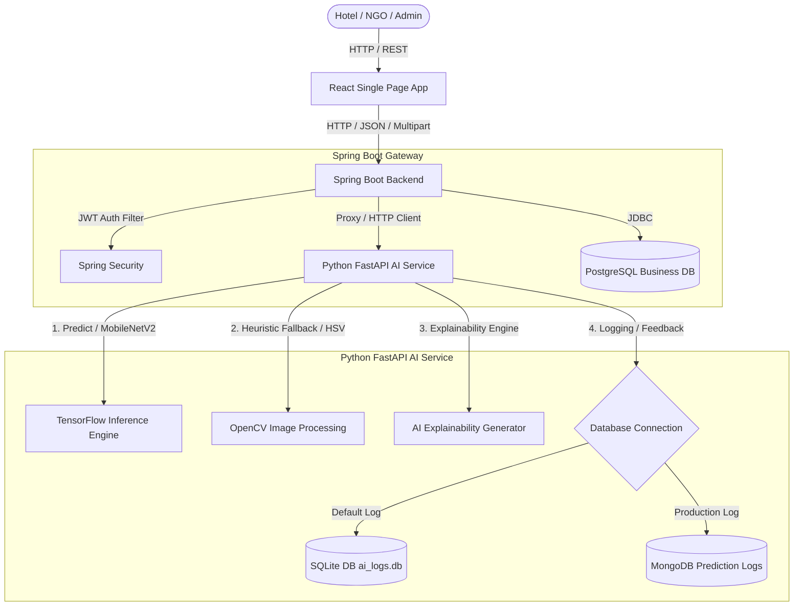
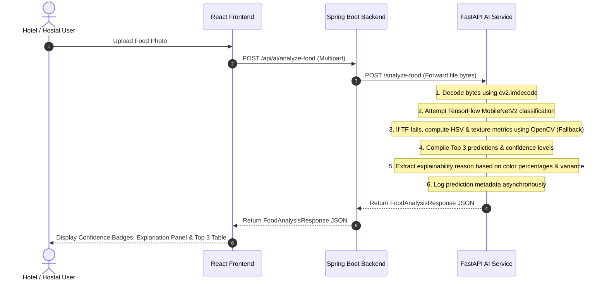
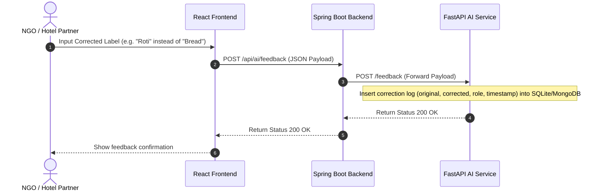

# FeedLink AI: Architecture & Intelligent Pipeline Documentation

This document describes the design, flow, and architecture of the FeedLink AI food recognition, serving estimation, and explanation systems. It details how the React Frontend, Spring Boot Backend, and Python FastAPI AI Service interact to provide production-grade social impact metrics.

---

## 1. System Architecture Diagram

The system is structured as a microservices architecture with Spring Boot acting as the main gateway/business logic server and Python FastAPI running as a dedicated AI/ML inference node.



---

## 2. Request Flows

### A. Food Recognition & Explainability Flow



### B. User Correction Feedback Learning Loop



---

## 3. Core Components

### A. Spring Boot Gateway (`backend`)
* **Role**: Authenticates incoming user requests using JWT tokens, handles business logic, and proxies data requests to the FastAPI service.
* **Controller**: `AiController.java` exposes proxy endpoints (`/api/ai/analyze-food`, `/api/ai/feedback`, `/api/ai/dataset-stats`, `/api/ai/model-version`).
* **Service**: `AiService.java` packages multipart requests and JSON payloads, forwarding them using a Spring RestTemplate to Python FastAPI.

### B. FastAPI AI Service (`ai-service`)
* **Role**: Conducts heavy compute operations including image preprocessing, TensorFlow neural network classification, OpenCV image feature extraction, and demand forecasting.
* **Framework**: FastAPI (asynchronous Python microframework) with standard ASGI server (Uvicorn).

---

## 4. Intelligent Pipeline Implementation Details

### A. MobileNetV2 TensorFlow Classification
* **Model**: A pre-trained `MobileNetV2` model loaded via `keras.applications`.
* **Initialization Safeguard**: If offline mode prevents downloading weight binaries from Google APIs, the model automatically compiles with random weights on a synthetic batch array:
  ```python
  # Compiling synthetic pipeline on start-up
  model = tf.keras.applications.MobileNetV2(weights=None, classes=len(classes))
  model.compile(optimizer='adam', loss='categorical_crossentropy')
  # Dry-run fit with synthetic labels
  model.fit(np.zeros((6, 224, 224, 3)), np.eye(6), epochs=1, verbose=0)
  ```
* **Prediction Mapping**: Extracts probabilities across six core classes: `["Biryani", "Rice", "Bread", "Curry", "Fruits", "Vegetables"]`.

### B. OpenCV Heuristic Fallback & Feature Extractors
If TensorFlow encounters an error, the pipeline falls back to an OpenCV color segmentation classifier:
* **HSV Color Spaces**: Defines segmentation masks to calculate color percentages:
  * **White** (Rice/Bread detection): `Hue [0-180]`, `Saturation [0-35]`, `Value [180-255]`
  * **Green** (Vegetables/Fresh Produce): `Hue [35-85]`, `Saturation [30-255]`, `Value [40-255]`
  * **Yellow/Orange** (Biryani/Curries): `Hue [10-25]`, `Saturation [45-255]`, `Value [50-255]`
  * **Red** (Fruits/Spiced Curries): `Hue [0-10] & [160-180]`, `Saturation [45-255]`, `Value [50-255]`
  * **Brown** (Cooked meats/gravies): `Hue [10-22]`, `Saturation [25-140]`, `Value [60-190]`
* **Texture Variance**: Uses grayscale pixel value standard deviations to estimate food textures (variance $\ge 2000$ indicates high grain/irregularity, common in rice or biryani; variance $< 800$ indicates smooth foods).

### C. Explainability Generation
For every classification, a human-readable reason string is compiled using the visual characteristics extracted from the image:
```python
# Sample explainability reasoning calculation
if food_type == "Rice":
    reason = f"The model detected high density of white/light grains (white percent: {white_pct:.1%}) with typical textured rice pattern."
elif food_type == "Biryani":
    reason = f"Identified yellow/orange spice grain textures (yellow percent: {yellow_orange_pct:.1%}) mixed with meat coloration."
```
These reasons are returned to the client and rendered in the explainability dashboard to establish user trust.

### D. Dual-Logging Telemetry & Learning Ingestion
* **MongoDB (Production)**: Stores all predictions in the `food_analysis` collection and feedback in `feedback_logs`.
* **SQLite (Fallback)**: Automatically operates in SQLite when MongoDB is offline, writing to tables `food_analysis` and `feedback_logs` inside local file database `ai_logs.db`.
* **Automatic Migrations**: Ensures table schemas are dynamically updated. If old column signatures are detected, the tables are safely migrated on startup.

---

## 5. Metrics & Verification Parameters

The system evaluates dataset changes and model performance using the following criteria:

* **Accuracy**: The ratio of correct predictions to the total dataset validation samples.
* **Precision**: The proportion of correctly predicted positive observations to the total predicted positives.
* **Recall**: The proportion of actual positives correctly identified by the model.
* **F1-Score**: The weighted harmonic mean of Precision and Recall.
* **Inference Latency**: The exact duration in seconds from when the image bytes are received to when the final response payload is compiled.
* **Inference Failure Rate**: Percentage of predictions with inference confidence $< 60\%$, requiring manual verification.
