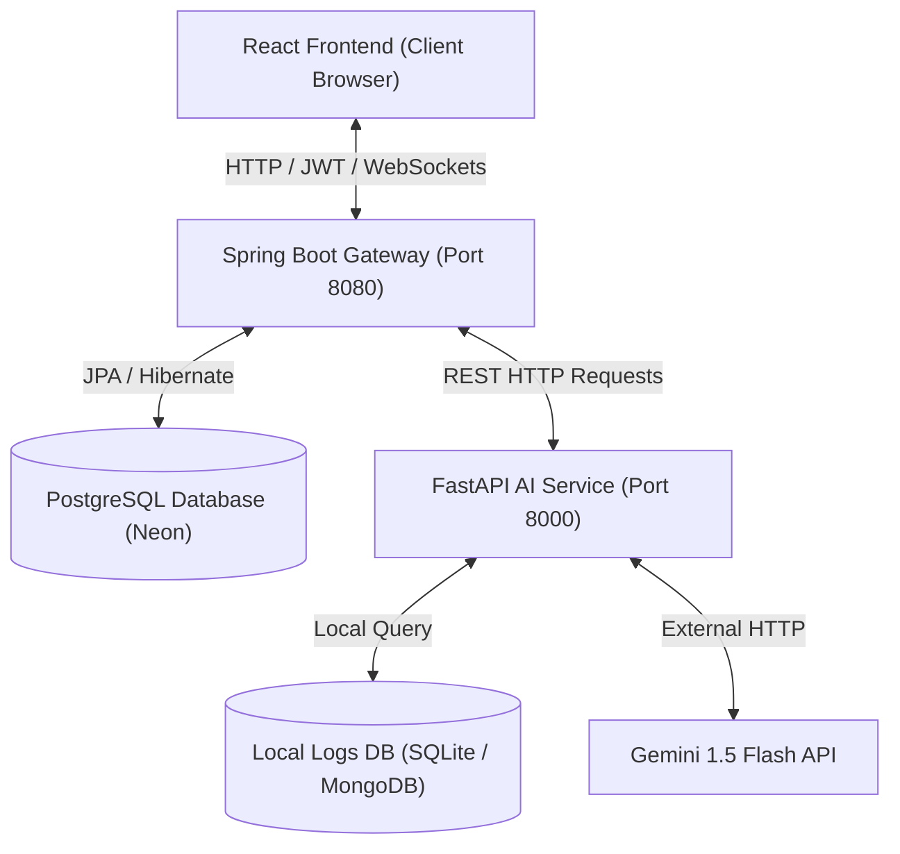
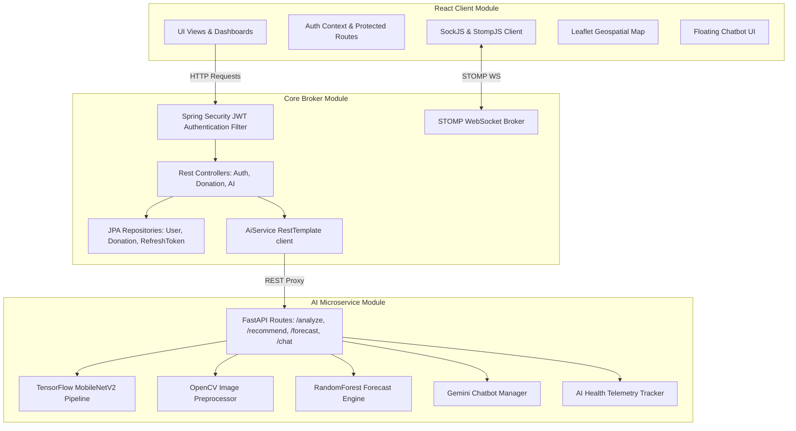
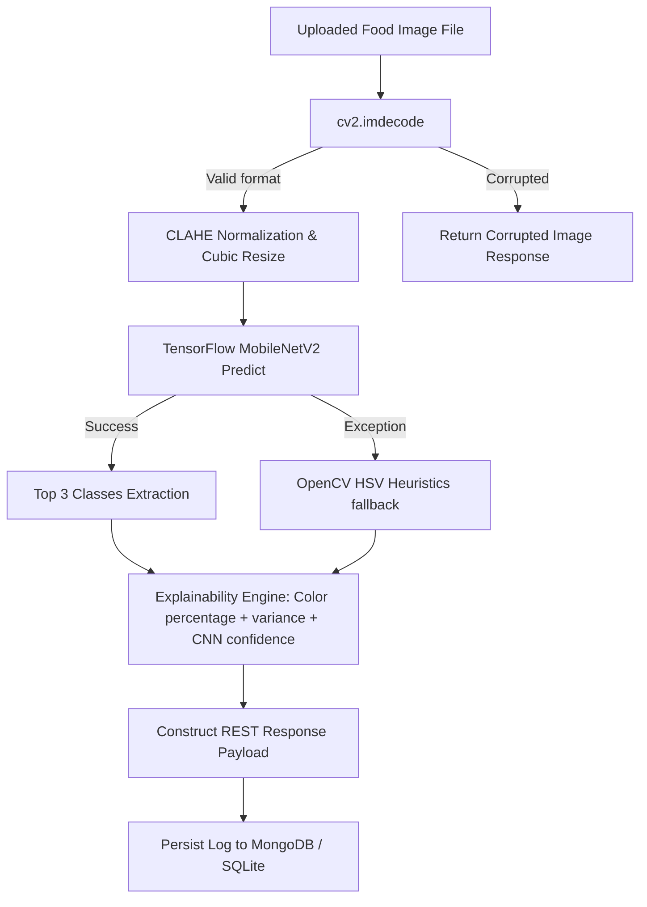

# Architecture Documentation
## FeedLink AI: Production-Grade Intelligent Social Impact Platform

---

### 1. High-Level System Architecture
FeedLink AI employs a decoupled microservices design separating frontend presentation, core business logic, database persistence, and deep learning services. The architecture balances performance, security, and fallback capability.



---

### 2. Component Diagram
The key software components are modularly isolated to maintain clear boundaries:



---

### 3. Deployment Diagram
FeedLink AI is designed for containerized or virtualized deployment. In production-ready setups, the database and services reside on separate VMs:

```mermaid
deploymentNode "Client Machine" {
    node "Browser Runtime" {
        artifact "Vite React SPA Bundle" as ClientApp
    }
}

deploymentNode "Application Server VM" {
    node "Java Virtual Machine (JRE 17)" {
        node "Tomcat Embedded Server" {
            artifact "Spring Boot Backend broker JAR" as BootApp
        }
    }
}

deploymentNode "AI Engine Server VM" {
    node "Python 3.10 Runtime Environment" {
        node "Uvicorn ASGI Server" {
            artifact "FastAPI AI Microservice app" as PyApp
            file "food_model.h5 weights file" as H5Model
        }
    }
}

database "Cloud Database Cluster" {
    folder "Relational Nodes" {
        database "PostgreSQL Database Instance" as PostgresDB
    }
    folder "NoSQL Document Nodes" {
        database "MongoDB Cluster / SQLite Local File" as MongoTelemetry
    }
}

ClientApp <--> BootApp : "HTTPS / WSS (Port 8080)"
BootApp <--> PostgresDB : "JDBC / SSL (Port 5432)"
BootApp <--> PyApp : "HTTP / Private Subnet (Port 8000)"
PyApp <--> MongoTelemetry : "MongoDB Protocol (Port 27017) / SQLite"
PyApp --> H5Model : "In-memory Model Load"
```

---

### 4. AI Microservice Architecture
The AI Service operates as a specialized pipeline, isolating deep learning inference, explainability compilation, and forecasting regression:



---

### 5. Spring Boot ↔ FastAPI Communication Diagram
The sequence details how the broker mediates request authorization and logs predictions concurrently:

```mermaid
sequenceDiagram
    autonumber
    actor Hotel as Hotel / Hostel Client
    participant Spring as Spring Boot Backend
    database PG as PostgreSQL DB
    participant FastAPI as FastAPI AI Service
    database SQLite as SQLite / MongoDB

    Hotel->>Spring: POST /api/ai/analyze-food (file, JWT token)
    Note over Spring: Validate JWT token & extract UserPrincipal email
    Spring->>FastAPI: POST /analyze (Multipart File, Header: X-User-Email)
    
    FastAPI->>FastAPI: Run Image Validation & CLAHE preprocessing
    FastAPI->>FastAPI: Execute MobileNetV2 / OpenCV Inference
    FastAPI->>FastAPI: Compile Explainability Reason text
    FastAPI->>SQLite: Log prediction result (imageUrl, userEmail, fallbackUsed)
    FastAPI-->>Spring: Return DTO (category, foodType, confidence, explanation, top3, imageUrl)
    
    Spring->>PG: Save prediction log (AIPredictionLog entity with confidence, imageUrl, userEmail)
    Spring-->>Hotel: Return FoodAnalysisResponse payload
```
