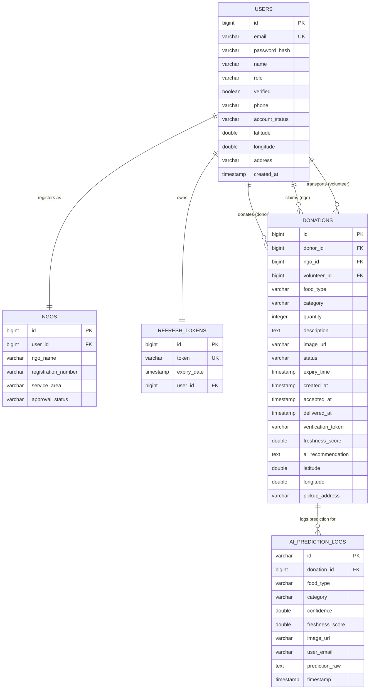

# Database Documentation
## FeedLink AI: Production-Grade Intelligent Social Impact Platform

---

### 1. Entity Relationship (ER) Diagram
The database is structured as a hybrid SQL + NoSQL system. PostgreSQL handles transactional user profiles, donation statuses, and audits, while MongoDB/SQLite manages high-volume AI telemetry, feedback loops, and chatbots.

---

### 2. Table Descriptions (PostgreSQL Transactional Database)

#### 2.1 Table: `users`
Stores details of registered hotels, hostels, NGOs, volunteers, and admins.
| Column | Type | Constraints | Description |
| :--- | :--- | :--- | :--- |
| `id` | `BIGINT` | Primary Key, Auto-increment | Unique identifier for the user. |
| `email` | `VARCHAR(255)` | Unique, Not Null | Email address used for login authentication. |
| `password_hash` | `VARCHAR(255)` | Not Null | BCrypt hashed password. |
| `name` | `VARCHAR(255)` | Not Null | Name of the establishment or individual. |
| `role` | `VARCHAR(50)` | Not Null | User role: `ADMIN`, `HOTEL`, `NGO`, `VOLUNTEER`. |
| `verified` | `BOOLEAN` | Default `FALSE` | Email or manual validation status flag. |
| `phone` | `VARCHAR(50)` | Nullable | Contact phone number. |
| `account_status` | `VARCHAR(50)` | Default `'PENDING'` | Status: `'PENDING'`, `'ACTIVE'`, `'SUSPENDED'`. |
| `latitude` | `DOUBLE PRECISION` | Nullable | Location latitude coordinate for matching. |
| `longitude` | `DOUBLE PRECISION` | Nullable | Location longitude coordinate for matching. |
| `address` | `VARCHAR(1000)` | Nullable | Textual address of the user establishment. |
| `created_at` | `TIMESTAMP` | Not Null | Registration timestamp. |

#### 2.2 Table: `ngos`
Stores NGO registration numbers, service areas, and verification statuses.
| Column | Type | Constraints | Description |
| :--- | :--- | :--- | :--- |
| `id` | `BIGINT` | Primary Key, Auto-increment | Unique NGO reference identifier. |
| `user_id` | `BIGINT` | Foreign Key (references `users.id`) | Links the NGO registration to a user account. |
| `ngo_name` | `VARCHAR(255)` | Not Null | Formal name of the non-profit organization. |
| `registration_number`| `VARCHAR(255)` | Not Null | Government issued registration code. |
| `service_area` | `VARCHAR(255)` | Nullable | Regional service bounds or neighborhoods. |
| `approval_status` | `VARCHAR(50)` | Default `'PENDING'` | Status: `'PENDING'`, `'APPROVED'`, `'REJECTED'`. |

#### 2.3 Table: `refresh_tokens`
Stores JWT refresh tokens mapping to user logins for session rotation.
| Column | Type | Constraints | Description |
| :--- | :--- | :--- | :--- |
| `id` | `BIGINT` | Primary Key, Auto-increment | Unique refresh token identifier. |
| `token` | `VARCHAR(255)` | Unique, Not Null | Encoded refresh token string value. |
| `expiry_date` | `TIMESTAMP` | Not Null | Expiration timestamp. |
| `user_id` | `BIGINT` | Foreign Key (references `users.id`) | Associated user account. |

#### 2.4 Table: `donations`
Stores listings of food surplus, status changes, and handover details.
| Column | Type | Constraints | Description |
| :--- | :--- | :--- | :--- |
| `id` | `BIGINT` | Primary Key, Auto-increment | Unique donation reference code. |
| `donor_id` | `BIGINT` | Foreign Key (references `users.id`) | Hotel/Hostel user who created the donation. |
| `ngo_id` | `BIGINT` | Foreign Key (references `users.id`) | Recipient NGO user who claimed the donation. |
| `volunteer_id` | `BIGINT` | Foreign Key (references `users.id`) | Assigned driver who delivers the donation. |
| `food_type` | `VARCHAR(255)` | Not Null | Classification name (e.g. `Chicken Biryani`). |
| `category` | `VARCHAR(255)` | Not Null | Broad category (e.g. `Prepared Meal`). |
| `quantity` | `INTEGER` | Not Null | Number of estimated servings. |
| `description` | `VARCHAR(2000)` | Nullable | Detailed textual comments. |
| `image_url` | `VARCHAR(255)` | Nullable | Web link to the uploaded image. |
| `status` | `VARCHAR(50)` | Default `'AVAILABLE'` | Status: `'AVAILABLE'`, `'ACCEPTED'`, `'DELIVERED'`. |
| `expiry_time` | `TIMESTAMP` | Not Null | Spoilage deadline limit. |
| `created_at` | `TIMESTAMP` | Not Null | Creation timestamp. |
| `verification_token` |`VARCHAR(255)` | Nullable | Unique security token encoded inside QR codes. |
| `freshness_score` | `DOUBLE PRECISION` | Default `85.0` | Freshness rating percentage from the AI. |
| `ai_recommendation` | `VARCHAR(1000)` | Nullable | Distribution advice (e.g. `Distribute in 4h`). |
| `latitude` | `DOUBLE PRECISION` | Not Null | Location latitude coordinate of the donor. |
| `longitude` | `DOUBLE PRECISION` | Not Null | Location longitude coordinate of the donor. |
| `pickup_address` | `VARCHAR(1000)` | Not Null | Textual address for donation collection. |

#### 2.5 Table: `ai_prediction_logs`
Stores auditable logs of all AI food classification requests.
| Column | Type | Constraints | Description |
| :--- | :--- | :--- | :--- |
| `id` | `VARCHAR(255)` | Primary Key | UUID generated locally by Spring Boot. |
| `donation_id` | `BIGINT` | Nullable | Mapped donation entity, if submitted. |
| `food_type` | `VARCHAR(255)` | Not Null | Inferred class name. |
| `category` | `VARCHAR(255)` | Not Null | Inferred food category. |
| `confidence` | `DOUBLE PRECISION` | Not Null | Model prediction confidence score. |
| `freshness_score` | `DOUBLE PRECISION` | Not Null | Inferred freshness score. |
| `image_url` | `VARCHAR(1000)` | Nullable | Link to the statically served image. |
| `user_email` | `VARCHAR(255)` | Default `'anonymous'` | Email of the hotel user requesting analysis. |
| `prediction_raw` | `VARCHAR(2000)` | Nullable | Raw JSON payload or explainability text. |
| `timestamp` | `TIMESTAMP` | Not Null | Audit timestamp. |

---

### 3. Collection Schemas (FastAPI Telemetry Database - SQLite / MongoDB)

When deployed with MongoDB (or local fallback SQLite `ai_logs.db`), the database maintains document collections capturing telemetry feedback loops:

- **`food_analysis`**:
  `{ id: ObjectId, foodType: String, category: String, confidence: Float, freshnessScore: Float, explanation: String, inferenceTime: Float, imageUrl: String, userEmail: String, fallbackUsed: Int, timestamp: Date }`
- **`feedback_logs`**:
  `{ id: ObjectId, originalPrediction: String, correctLabel: String, userRole: String, confidenceBeforeCorrection: Float, timestamp: Date }`
- **`serving_predictions`**:
  `{ id: ObjectId, estimatedServings: Int, confidence: Float, quantityEntered: String, foodType: String, timestamp: Date }`
- **`ngo_recommendations`**:
  `{ id: ObjectId, recommendedNGOs: Array, foodType: String, servings: Int, timestamp: Date }`
- **`demand_forecasts`**:
  `{ id: ObjectId, expectedDonationsTomorrow: Float, expectedNgoDemandTomorrow: Float, expectedFoodSurplusTomorrow: Float, confidenceInterval: Array, highRiskZones: Array, timestamp: Date }`
- **`chatbot_conversations`**:
  `{ id: ObjectId, conversationId: String, role: String, userMessage: String, botResponse: String, timestamp: Date }`
