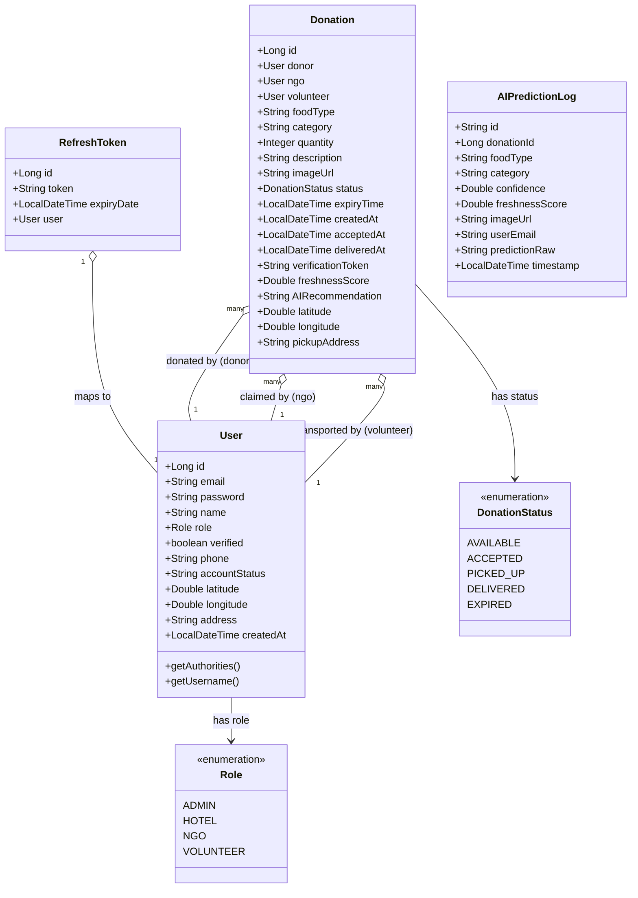
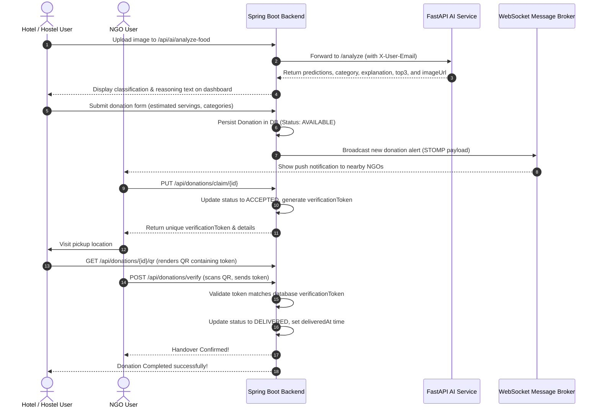
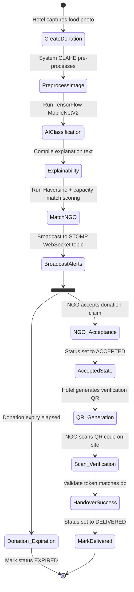
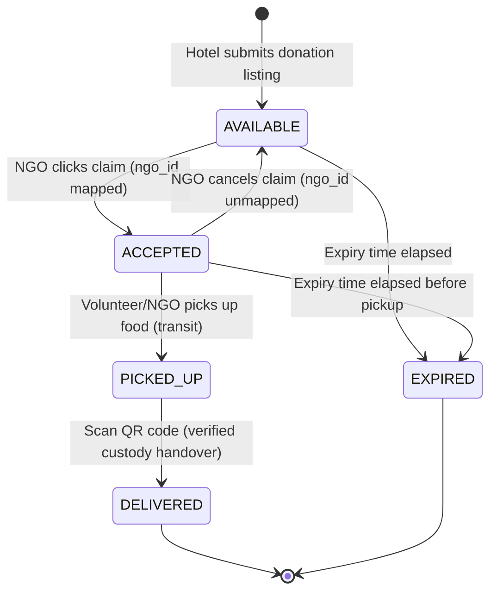

# UML Diagrams
## FeedLink AI: Production-Grade Intelligent Social Impact Platform

---

### 1. Use Case Diagram
This diagram outlines the interactions between primary system actors (Hotels & Hostels, NGOs, Admins) and core platform modules.

```mermaid
left-to-right direction
actor "Hotel & Hostels (Donor)" as Hotel
actor "NGO Partner (Recipient)" as NGO
actor "Administrator (System Manager)" as Admin

rectangle FeedLinkAISystem {
    %% Authentication
    usecase "Authenticate (Login/Register/Logout)" as UC_Auth
    usecase "Manage User Profile" as UC_Profile
    
    %% Hotel Use cases
    usecase "Analyze Food Image (Classification & Freshness)" as UC_Analyze
    usecase "Estimate Serving Size" as UC_Estimate
    usecase "Submit Food Donation" as UC_Donate
    usecase "Generate Custody Verification QR" as UC_GenQR
    usecase "View Carbon Offset Metrics" as UC_Carbon
    
    %% NGO Use cases
    usecase "Browse Proximity Donations (Maps)" as UC_Browse
    usecase "Accept Donation Claim" as UC_Accept
    usecase "Scan QR Code for Handover Verification" as UC_ScanQR
    
    %% Admin Use cases
    usecase "Approve/Suspend User Accounts" as UC_Approve
    usecase "Monitor AI Telemetry & Pipeline Health" as UC_Health
    usecase "Inspect Auditable Prediction Logs" as UC_Logs
    usecase "View Predictive Demand Forecasts" as UC_Forecast
}

%% Hotel Connections
Hotel --> UC_Auth
Hotel --> UC_Profile
Hotel --> UC_Analyze
Hotel --> UC_Estimate
Hotel --> UC_Donate
Hotel --> UC_GenQR
Hotel --> UC_Carbon

%% NGO Connections
NGO --> UC_Auth
NGO --> UC_Profile
NGO --> UC_Browse
NGO --> UC_Accept
NGO --> UC_ScanQR

%% Admin Connections
Admin --> UC_Auth
Admin --> UC_Approve
Admin --> UC_Health
Admin --> UC_Logs
Admin --> UC_Forecast
```

---

### 2. Class Diagram
Renders the relational entities in Spring Boot backend, showing fields, type signatures, and relative relationships:



---

### 3. Sequence Diagram (End-to-End Donation Verification)
Details the lifecycle of a food surplus listing, from initial image analysis through to the final QR-verified custody transfer to an NGO.



---

### 4. Activity Diagram
Depicts the flow of actions from the creation of a donation, through the routing, to the confirmation of receipt:



---

### 5. State Diagram (Donation Status Transitions)
Shows the formal states a food donation goes through, capturing standard flows and expiration boundaries:


